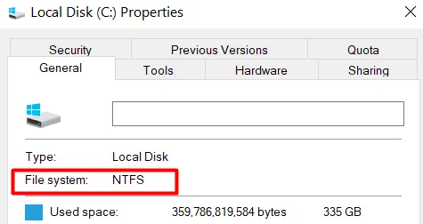
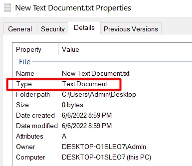

# File System in Node.js

A Node.js module for performing basic file operations like creating directories, writing files, reading files, and deleting files.

## File System Concept

A file system is the structure within an operating system to organize, control, and store data. Besides control, file systems add features like access layers, attributes, and conventions. File systems serve as interfaces to devices connected to the computer, such as USB drives and external storage.

Common file systems across different OS are:

- **Windows:** FAT16, FAT32, exFAT, NTFS
- **macOS:** HFS+, APFS
- **Linux:** Ext4

> **Note:** To check your system's file system, consult the OS documentation. For example, on Windows:

## File Concept

A file is a sequence of bytes stored on a device, with a name and an extension (e.g., `.jpg`, `.txt`) that describes its content, enabling programs to handle it appropriately.

> **Note:** To view a file's details, check its properties on your system.

## Module: File System

Node.js includes a core module for file manipulation, the `fs` (File System) module. This module enables file support across different operating systems, working with callbacks, streams, and events.

### Basic File Handling Methods

The `fs` module provides the following methods for basic file manipulation:

1. **Creating Directory:** `mkdir` (asynchronous) or `mkdirSync` (synchronous)
2. **Writing Files:** `writeFile` (asynchronous) or `writeFileSync` (synchronous)
3. **Reading Files:** `readFile` (asynchronous) or `readFileSync` (synchronous)
4. **Deleting Files:** `unlink` (asynchronous) or `unlinkSync` (synchronous)

These methods are available in both asynchronous (default) and synchronous (Sync) modes.

---

### 1. Creating Directory

Below are examples of creating a directory asynchronously and synchronously.

- **`mkdir` (Asynchronous)**  
  [Example Code](1.fs_mkdirAsync.js)

- **`mkdirSync` (Synchronous)**  
  [Example Code](2.fs_mkdirSync.js)

---

### 2. Writing Files

Below are examples of creating and writing to a file asynchronously and synchronously.

- **`writeFile` (Asynchronous)**  
  [Example Code](3.fs_writeFileAsync.js)

- **`writeFileSync` (Synchronous)**  
  [Example Code](4.fs_writeFileSync.js)

---

### 3. Reading Files

Below are examples of reading the content of a file asynchronously and synchronously.

- **`readFile` (Asynchronous)**  
  [Example Code](5.fs_readFileAsync.js)

- **`readFileSync` (Synchronous)**  
  [Example Code](6.fs_readFileSync.js)

---

### 4. Deleting Files

Below are examples of deleting a file asynchronously and synchronously.

- **`unlink` (Asynchronous)**  
  [Example Code](7.fs_unlinkAsync.js)

- **`unlinkSync` (Synchronous)**  
  [Example Code](8.fs_unlinkSync.js)

---

This module demonstrates core operations on the file system, showing how Node.js handles files across different operating systems.
